# 🔐 SSH Linux Lab — Secure Remote Access & Hardening Demo

This project demonstrates how to set up secure SSH communication between two Linux systems — an Ubuntu Desktop (client) and an Ubuntu Server (host). It includes key-based authentication, SSH hardening practices, and real-world troubleshooting using systemd overrides.

**Note: All IP addresses shown in this lab have been redacted or replaced with placeholders for security and privacy.**

---

## 🖥️ Environment

- **Client:** Ubuntu Desktop (running in VirtualBox on Windows 11)
- **Server:** Ubuntu Server (SSH enabled)
- **Hypervisor:** VirtualBox
- **Connection:** Both systems on the same LAN

---

## 🔧 Setup Process

### 1. Check For Ubuntu Desktop Updates
Because the Ubuntu Desktop was a fresh installation, I updated the system to ensure all packages were current. Keeping software updated is a key security practice. It reduces exposure to CVEs (Common Vulnerabilities and Exposures) and potential exploits.

```bash
sudo apt update
```

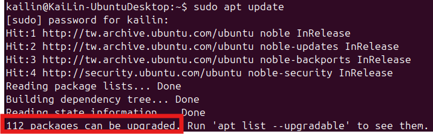

Because there were 112 packages available for upgrade, I ran the following command to apply them:
```bash
sudo apt upgrade
```

Lastly, I ensured that the SSH client was installed on the Ubuntu Desktop:
```bash
sudo apt install openssh-client
```

---

### 2. Identify Server IP Address
To connect to the server from the Desktop, I first identified the server’s IP address using:
```bash
ip a | grep inet
```
Or:
```bash
ifconfig
```

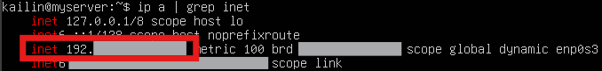
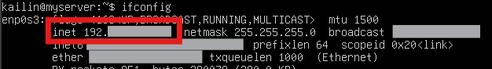

---

### 3. Test Password-Based SSH Connection
Using the server’s IP address, I initiated an SSH connection from the Ubuntu Desktop:
```bash
ssh kailin@192.168.xxx.xxx
```
When prompted about the host fingerprint, I typed `yes` to continue. 

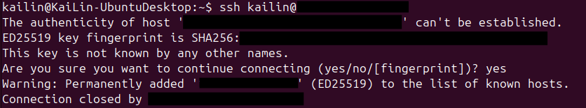
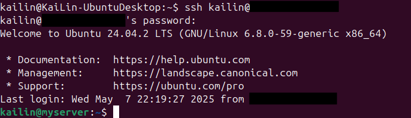

After logging in, I checked the Ubuntu Server’s /var/log/auth.log file to confirm the login attempt was recorded successfully:

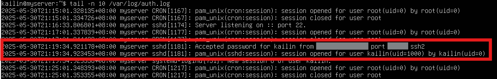

At this point, I had successfully connected from one Linux system to another. However, repeatedly entering the password can be inconvenient. A more secure and efficient method is to use SSH key-based authentication.

---

### 4. Generate SSH Key and Copy to Server
On the Ubuntu Desktop, I generated an SSH key pair with strong encryption:
```bash
ssh-keygen -t rsa -b 4096 -C "kailin@UbuntuDesktop"
```

- `-t rsa`: Specifies RSA as the algorithm
- `-b 4096`: Specifies a 4096-bit key length for stronger encryption, as opposed to the more commonly used 2048-bit default
- `-C`: Adds a comment for identification

Additionally, I entered a passphrase to increase the security of the login process.

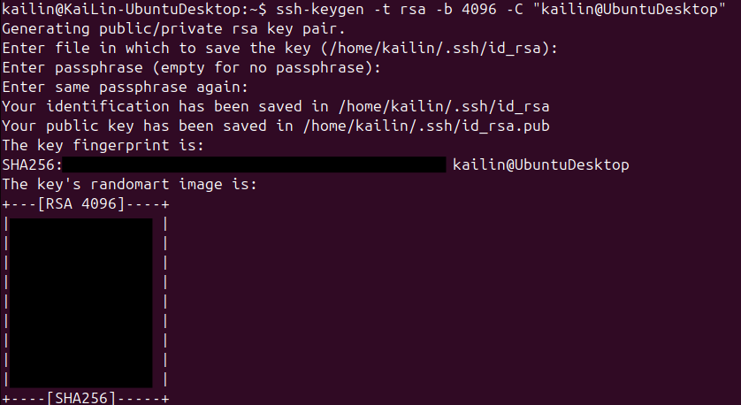

Next, I copied the public key to the Ubuntu Server:
```bash
ssh-copy-id kailin@192.168.xxx.xxx
```
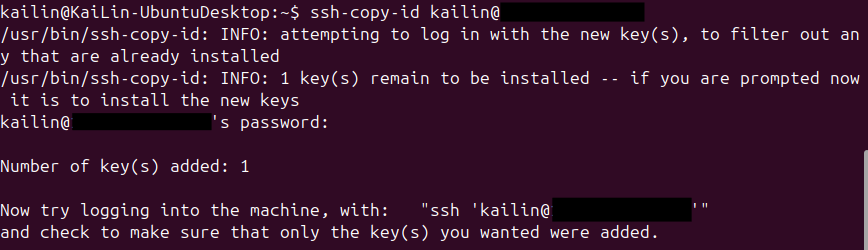

---

### 5. SSH Login Using Key Authentication
After the key was copied, I tested the connection:
```bash
ssh kailin@192.168.xxx.xxx
```
This time, I was prompted for the key passphrase instead of the server password, confirming that key-based authentication was working.

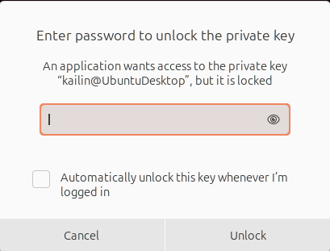
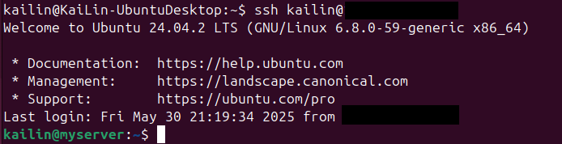
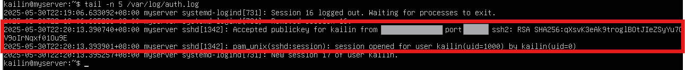

---

## 🔐 SSH Hardening (Concept and Intent)
As part of this project, I practiced SSH hardening to better understand how to secure system access and protect digital infrastructure. The goal was to:

- Minimize attack surface
- Practice secure access control
- Simulate tasks a system administrator would perform in the real world

During this process, I encountered a significant issue where SSH was not listening on the custom port I had configured. I documented this real-world troubleshooting and resolution experience in detail.

📄 **See full breakdown here**: [linux/ssh-hardening.md](linux/ssh-hardening.md)

---

## 🧠 What I Learned

- How to properly configure and harden an SSH server
- How systemd unit files can override expected behavior
- How to use `ss`, `journalctl`, `systemctl cat`, and `sshd -T` for debugging
- Why key-based authentication is a security best practice
- Importance of keeping systems up to date for security and compatibility

---

## ✅ Result
SSH now runs on port 2222 with password login disabled and only accepts key-based access — a hardened and secure configuration suitable for portfolio and professional server setups.
