# 🔐 Windows SSH Setup & Cross-Platform SFTP

This section documents the process of enabling SSH access on a Windows 11 Pro system. Using an Ubuntu Desktop virtual machine, I connect into the Windows PC via SSH, then demonstrate a secure file transfer from Windows to Ubuntu using SFTP.  
My goal for this portion of the lab is to gain hands-on experience with **cross-platform SSH and SFTP workflows** in a home lab environment.

---

## ⚙️ SSH Server Installation on Windows

Since this was my first time using SSH on my Windows 11 Pro system, I began by checking whether both the **OpenSSH Client** and **OpenSSH Server** features were installed through the use of powershell:

```powershell
Get-WindowsCapability -Online | Where-Object Name -like 'OpenSSH*'
```
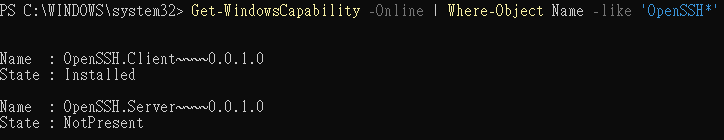

The output showed that **OpenSSH.Client** was already installed, but **OpenSSH.Server** was not.

To install the SSH server, I ran:

  ```powershell
  Add-WindowsCapability -Online -Name OpenSSH.Server~~~~0.0.1.0
  ```

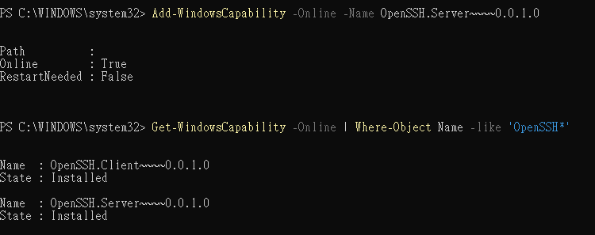

Although Windows allows enabling the SSH server to start automatically on boot, I intentionally chose not to enable auto-start.
This decision helps reduce the attack surface and limits the exposure window within my home lab environment.

Instead, I manually start the SSH server only when needed:

  ```powershell
  Start-Service sshd
  ```

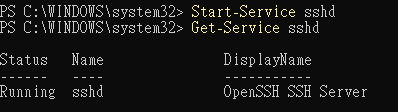

---

## 🛡️ Firewall Rule Verification

The next step was to check whether **Windows Defender Firewall** was blocking SSH connections.  
I know that by default, Windows Firewall may block **port 22** unless it's explicitly allowed.
However, instead of blindly enabling new firewall rules, I first verified the existing ones by running:


  ```powershell
  Get-NetFirewallRule -DisplayName "*OpenSSH*"

  ```

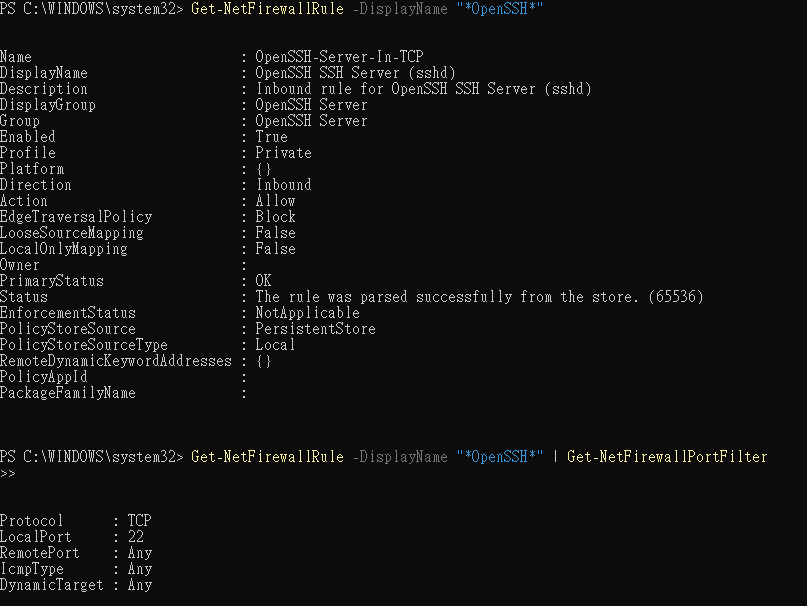

From the output, I confirmed that the OpenSSH SSH Server (sshd) rule was already active and allowing inbound connections on port 22.

---

## 🌐 Finding the Correct IP Address

In order to connect to my Windows system using SSH, I needed to find its IP address.  
While using `ipconfig` alone is enough, the output includes a lot of extra information.  
To narrow it down to just the relevant lines, I used `ipconfig` along with `findstr` to search for lines containing "IPv4":

  ```powershell
  ipconfig | findstr /R "IPv4"
  ```

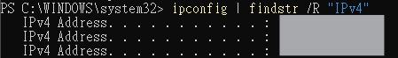

An unexpected result occurred: I saw three different IPv4 addresses.
This was due to multiple Linux VMs I had previously run using VirtualBox, which created additional virtual network interfaces.

To identify the correct IP address for the active physical adapter, I ran:

  ```powershell
  Get-NetIPAddress -AddressFamily IPv4 | Where-Object {$_.IPAddress -notlike "169.*"} | Format-Table InterfaceAlias, IPAddress
  Get-NetAdapter | Where-Object {$_.Status -eq "Up"}
  ```

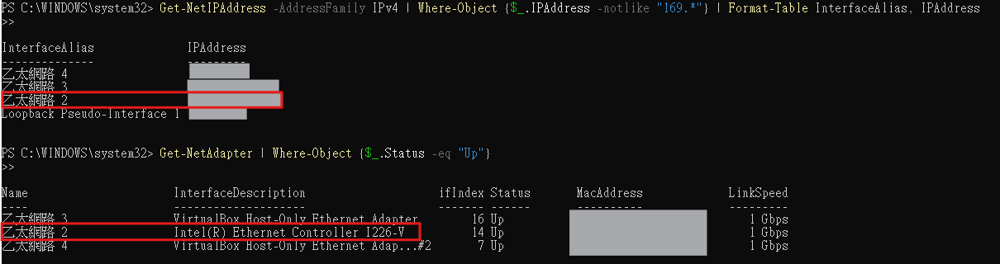

From the results, I determined that `Ethernet 2` was the main physical adapter, while `Ethernet 3` and `Ethernet 4` were VirtualBox virtual interfaces.

---

## 👤 Secure User Account Isolation

To maintain a clean separation between personal use and home lab activity, I created a dedicated local user account on my Windows 11 PC specifically for SSH testing. This allows me to keep my main daily-use account excluded from lab access, improving both security and privacy. 

The account was created using PowerShell:

  ```powershell
  net user Homelab StrongPassword123! /add
  ```
**Note**: The username and password shown above are placeholders and do not reflect the actual credentials used.

By isolating lab access to a separate account, I now have a secure and controlled environment for running SSH-related experiments without impacting my primary Windows session.

---

## 🪟 Linux to Windows SSH

With the SSH server set up on my Windows 11 PC and a dedicated user account created for home lab testing, I was ready to initiate an SSH connection from my Ubuntu Desktop.
On the Ubuntu system, I tested the connection using:

```bash
ssh user@192.xxx.xxx.xxx
```
**Note**: Both the username and IP address above are placeholders and do not reflect the actual credentials used.

After entering the password for the SSH test user, I was successfully connected to my Windows PC from Ubuntu.

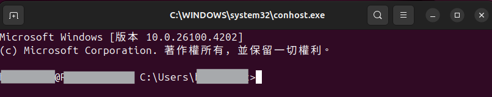

---

## 📦 SFTP from Windows to Ubuntu

While connected to Windows via SSH from Ubuntu, I decided to test **SFTP from Windows to Ubuntu** to further build hands-on knowledge around secure file transfers in a cross-platform environment.

Although SFTP itself is a straightforward protocol, I encountered a few issues during setup, which turned out to be great learning opportunities. Each problem helped me gain a better understanding of SSH and better prepare for similar issues in the future.

### 🧪 Troubleshooting & Fixes:

1. SSH Server Not Installed on Ubuntu
In order for SFTP to work, I would need to make sure that SSH server is also running on my Ubuntu Desktop.
I first check the status of SSH using:

```bash 
sudo systemctl status ssh
```

When I tried to start the SSH service on my Ubuntu Desktop, I encountered this error:


The message indicated that ssh.service could not be found. This is because I had installed Ubuntu Desktop with only the basic packages, and the SSH server (sshd) was not included by default.
To fix it, I installed the necessary package:
```bash
sudo apt install openssh-server
```

2. SSH Failed to Start: Missing Host Keys
After installing the server, I attempted to start the SSH service:
```bash
sudo systemctl start ssh
```

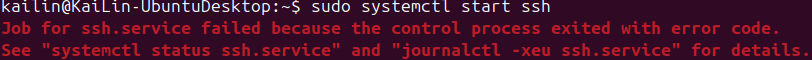

However, the command failed. To diagnose the issue, I ran:

```bash
sudo sshd -t
```


The output revealed that the service could not start due to missing host keys. This was also because of the minimal Ubuntu installations.
To generate the required keys, I used this:

```bash
sudo ssh-keygen -A
```
After generating the host keys, the SSH service started successfully.

3. Eort 22 Timeout When Connecting from Windows
After confirming that SSH was running on Ubuntu and reconnecting to Windows, I attempted to open an SFTP session from Windows to Ubuntu, but received a **"Port 22 connection timed out"** error.

The root cause turned out to be that my Ubuntu Desktop VM was configured to use NAT mode in VirtualBox. NAT mode isolates the VM behind a virtual NAT interface, blocking direct inbound connections from the host system or other devices on the LAN.

To resolve this, I changed the VirtualBox network setting from NAT to Bridged Adapter, which allowed the VM to obtain a LAN IP and communicate directly with the host system.

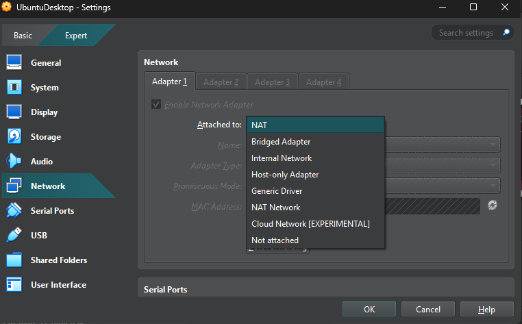

After restarting the VM, I reconnected to Windows via SSH and used the following PowerShell command to verify connectivity:

```powershell
Test-NetConnection -ComputerName 192.xxx.xxx.xxx -Port 22
```

The test succeeded, which confirms the fix.

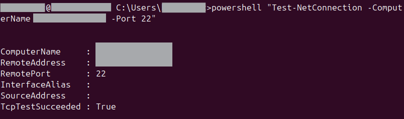


### 📁  SFTP Process (Windows → Ubuntu)

Once SSH connectivity was confirmed between the two systems, I performed a secure file transfer from my Windows 11 PC to my Ubuntu Desktop using SFTP. Here’s a step-by-step breakdown of the process:

1. Created a test file on the Windows system
To simulate a basic transfer scenario, I first created a simple text file using PowerShell. This file served as the content I wanted to upload to my Ubuntu machine:

   ```powershell
   echo "This file was sent from Windows to Ubuntu Desktop via SFTP" > test_sftp_from_windows.txt
   ```
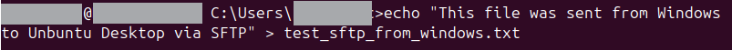

2. Opened an SFTP session from Windows to Ubuntu
Still within my SSH session on Windows, I initiated an SFTP connection to my Ubuntu Desktop using the built-in SFTP command-line tool. I specified the IP address and username of the Ubuntu machine:

   ```powershell
   sftp user@192.xxx.xxx.xxx
   ```

After entering the correct password, the connection to the Ubuntu SFTP server was established successfully. 

3. Navigated to the target directory on Ubuntu and uploaded the file
Once inside the SFTP session, I navigated to the Documents directory of the Ubuntu user. Then, I uploaded the test file created earlier
   ```sftp
   cd Documents
   put test_sftp_from_windows.txt
   ```
This command securely transferred the file over SSH from the Windows home directory to the Documents folder on the Ubuntu system.

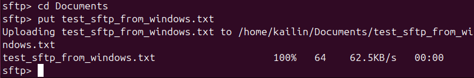

4. Verified that the file arrived on the Ubuntu machine
To ensure the file was successfully transferred, I checked the target directory on Ubuntu Desktop by going directly to the Documents folder.

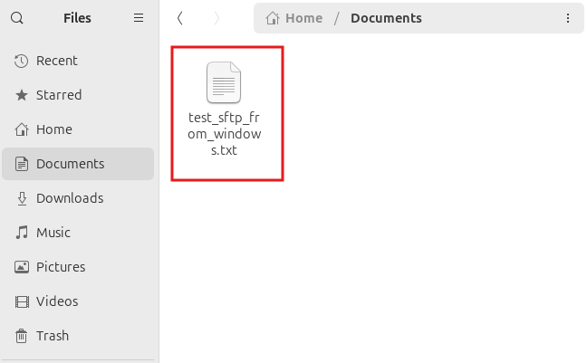

The file `test_sftp_from_windows.txt` was present, confirming that the SFTP transfer from Windows to Ubuntu had completed successfully.

📝 Conclusion
This project allowed me to gain valuable hands-on experience with configuring and using OpenSSH on both Windows and Linux platforms. Throughout the process, I successfully accomplished the following:

- Enabled and secured SSH access on a Windows 11 Pro system without enabling auto-start, reducing unnecessary exposure in a home lab environment.
- Created a dedicated, non-admin user account for SSH testing to separate personal use from lab experiments, following best security practices.
- Connected from an Ubuntu Desktop VM to my Windows machine using SSH.
- Performed a secure file transfer (SFTP) from Windows to Ubuntu over SSH.
- Troubleshot and resolved common issues related to:
  - Missing SSH server on Ubuntu
  - Missing host keys on a minimal Linux install
  - Inbound port blocks caused by VirtualBox’s NAT mode
- Gained a deeper understanding of SSH services, host key management, firewall validation, and network interface roles across platforms.

More than just getting things to work, this project gave me the opportunity to practice diagnosing real-world issues, improving both my confidence and my troubleshooting methodology. These are exactly the types of challenges I expect to encounter in IT system administration or cybersecurity work, and this lab allowed me to gain confidence in problem solving and understanding the root cause of each issue.